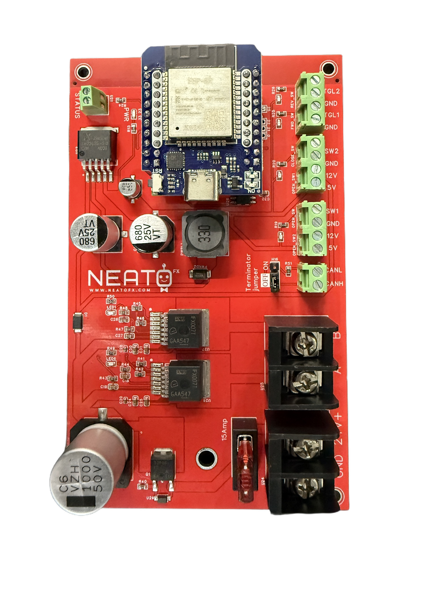

# NeatoFx Motor - WiFi Motor & Actuator Controller

The NeatoFx Motor is a professional-grade WiFi-enabled motor controller for interactive attractions, escape rooms, and entertainment systems. One board, four selectable behaviors: hold-to-run joystick control (DC or 240VAC drive), encoder-based winch control with auto-homing and soft limits, dual pulse/air-valve firing, and simple manual joystick mode. Optional CAN bus networking lets multiple controllers coordinate as a game, and an optional MP3 sound module adds motion-synced audio.



## Table of Contents

- [Overview](#overview)
- [Board Variants](#board-variants)
- [Hardware](#hardware)
- [Getting Started](#getting-started)
- [Standard Board (Joystick)](#standard-board-joystick)
- [Winch Board](#winch-board)
- [Pulse Board](#pulse-board)
- [Manual Board](#manual-board)
- [CAN Bus Add-on](#can-bus-add-on)
- [Sound Add-on](#sound-add-on)
- [Safety Features](#safety-features)
- [Troubleshooting](#troubleshooting)

## Overview

The NeatoFx Motor drives:

- **Animated Props**: Moving arms, rotating heads, opening mechanisms
- **Door/Gate Actuators**: Automated entry and exit systems
- **Linear Actuators**: Extending/retracting motion for interactive displays
- **Winches & Hoists**: Position-tracked lifting and lowering with auto-homing
- **Air Valves / Solenoids**: Timed pulse firing for pneumatic effects
- **240VAC Motor Controllers**: Dry-contact style direction control
- **Multi-Station Games**: CAN-networked controllers gated by a central game display

All behaviors run on the same Rev 3.x hardware — you pick the behavior at compile time by selecting one board package in `main.yaml`.

## Board Variants

Select exactly one **board** in `main.yaml`:

| Board package | Behavior |
|---|---|
| `boards/rev3.yaml` | **Standard** — hold-to-run joystick with limit switches, ramping, current trip, CAN game-gating. Pick a **drive** (DC or AC) below. |
| `boards/rev3_winch.yaml` | **Winch** — Hall-effect quadrature encoder position tracking, auto-homing on boot, soft length limits, two-zone speed, soft direction-change ramping. |
| `boards/rev3_pulse.yaml` | **Pulse** — two independent outputs fired for a configurable time (default 100 ms) per input press. For air valves and solenoids. |
| `boards/rev3_manual.yaml` | **Manual** — pure hold-to-run joystick with hard limit stops. No encoder, no timer, no CAN gating. |

For the standard board, also select exactly one **drive**:

| Drive package | Behavior |
|---|---|
| `boards/common/drive_dc.yaml` | 24V DC motor via PWM with configurable start ramp (default) |
| `boards/common/drive_ac.yaml` | 240VAC controller: grounds one logic input (M1/M2), leaves the other open — no PWM, dry-contact style |

Optional **add-ons** (uncomment in `main.yaml`):

| Add-on package | Behavior |
|---|---|
| `boards/common/can.yaml` | CAN inter-controller bus — game-gates the joysticks from a central broadcast, exposes remote drive + telemetry |
| `boards/common/sound.yaml` | DY-SV5W MP3 module — loops an idle track / run track synced to game and motor state (requires CAN) |

## Hardware

### Board Specifications
- **MCU**: ESP32 (Wemos D1 Mini32)
- **Motor Driver**: 2× BTN8962TA H-bridge
- **Max Current**: 8A per direction with over-current trip (threshold configurable)
- **Operating Voltage**: 7V–24V DC motor supply
- **WiFi**: 802.11 b/g/n (2.4GHz only)
- **CAN**: SN65HVD232 transceiver, 250 kbps (optional)

### Rev 3.x Pin Map

| Pin | Function | Notes |
|-----|----------|-------|
| GPIO19 | R_PWM | Direction 1 / forward / reel-out / Valve A |
| GPIO18 | L_PWM | Direction 2 / reverse / reel-in / Valve B |
| GPIO17 | R_EN | Right H-bridge enable |
| GPIO16 | L_EN | Left H-bridge enable |
| GPIO34 | R_IS | Direction 1 current sense (ADC) |
| GPIO35 | L_IS | Direction 2 current sense (ADC) |
| GPIO32 | Input 1 | Joystick forward / trigger A (hold-to-run) |
| GPIO27 | Input 2 | Joystick reverse / trigger B (hold-to-run) |
| GPIO25 | SW1 | Open/forward limit switch (standard board) |
| GPIO13 | SW2 | Closed/reverse limit switch — Hall B on winch board |
| GPIO4 | — | CAN RX (with CAN add-on) — Hall A on winch board — open limit on manual board |
| GPIO5 | CAN TX | With CAN add-on |
| GPIO26 | Status LED | Home limit switch on winch board |
| GPIO21/22 | Sound UART | DY-SV5W TX/RX (with sound add-on) |

Note the pin sharing: the winch board repurposes GPIO4/GPIO13 for the Hall encoder and GPIO26 for the home limit switch; the CAN add-on claims GPIO4/GPIO5, which is why the standard board's open limit switch lives on GPIO25.

### Power Requirements
- **Motor supply**: match your motor voltage (7–24V DC), 10A+ recommended
- **Stall current**: over-current trip defaults to 8A (winch) / configurable 4–30A via CAN settings (standard)

## Getting Started

### Step 1: Choose Your Behavior

Edit `main.yaml` and uncomment exactly one board (and one drive if using the standard board):

```yaml
packages:
  # ---- BOARD / BEHAVIOR — select exactly ONE ----
  board: !include boards/rev3.yaml             # Standard: hold-to-run joystick
  #board: !include boards/rev3_winch.yaml      # Winch: encoder, auto-homing, soft limits
  #board: !include boards/rev3_pulse.yaml      # Pulse: momentary pulse drive
  #board: !include boards/rev3_manual.yaml     # Manual: self-contained, never CAN-gated

  # ---- DRIVE — standard board only ----
  drive: !include boards/common/drive_dc.yaml    # 24V DC motor via PWM ramp
  #drive: !include boards/common/drive_ac.yaml   # 240VAC controller

  # ---- NETWORK — select ONE ----
  config: !include configs/networked.yaml        # Home Assistant API + web UI + OTA
  #config: !include configs/standalone.yaml      # AP-only: local web UI + OTA

  # ---- OPTIONAL ADD-ONS ----
  #can:   !include boards/common/can.yaml        # CAN inter-controller bus
  #sound: !include boards/common/sound.yaml      # DY-SV5W audio module
```

### Step 2: Flash Firmware

1. Place your WiFi credentials in `secrets.yaml` (one directory above this repo).
   See [`_shared/secrets.template.yaml`](../../_shared/secrets.template.yaml).

2. Flash:
   ```bash
   esphome -s id 1 run Controllers/NeatoMotor/main.yaml
   ```

### Step 3: Connect

- **Networked mode**: device appears in Home Assistant automatically; web UI at `http://motor-1.local`
- **Standalone mode**: connect to the `motor-1` WiFi AP, then browse to `http://192.168.4.1`

## Standard Board (Joystick)

Hold-to-run control: hold Input 1 to run forward, Input 2 to run reverse, release to stop. Limit switches SW1/SW2 are hard stops for their direction.

Web UI settings:
- **Motor Speed** — PWM duty (%) the motor ramps up to
- **Start Ramp** — ms to ramp from 0 to speed on every start (0 = instant)
- **Limit Switches NC Mode** — invert both end-stops for normally-closed wiring

With the CAN add-on, the joystick inputs are armed only while the game is active (0x100 broadcast). Boot state is inactive — the joysticks do nothing until a game-active frame arrives. CAN remote drive commands work regardless.

The **AC drive** variant turns the two H-bridge halves into dry contacts for an external 240VAC motor controller: holding Input 1 grounds output A (M1) and floats output B (M2); holding Input 2 does the opposite; release floats both.

## Winch Board

Position-tracked winch control using an 8-magnet Hall-effect quadrature encoder (32 counts/rev):

- **Auto-homing on boot** — reels in at slow speed until the home limit switch fires; that switch is the authoritative zero
- **Position memory** — the running count is persisted to flash across reboots
- **Soft limits** — after calibrating max length, reel-out stops automatically at max count
- **Two-zone speed** — full speed in mid-travel, slow speed near either end
- **Soft direction change** — ramp down → brake pause → ramp up when reversing (configurable, 0 = instant)
- **Stall detection** — 8A trip on either direction, emergency stop

Joystick: hold reel-out (GPIO32) / reel-in (GPIO27), release to stop.

## Pulse Board

Two independent outputs for air valves or solenoids:

- Input 1 press fires Valve A (output driven HIGH for the configured pulse time)
- Input 2 press fires Valve B
- **Pulse Time** configurable from the web UI (default 100 ms)

## Manual Board

The simplest variant: hold-to-run joystick with hard limit-switch stops. No encoder, no timers, no auto-reverse, and never CAN-gated — inputs always work. Good for service winches and anything an operator drives by hand.

## CAN Bus Add-on

250 kbps, 11-bit IDs, node address = the `id` substitution. Frame map:

| ID | Dir | Purpose |
|----|-----|---------|
| `0x100` | RX | Game gate + settings broadcast (all nodes, ~5 Hz): active flag, motor ramp, speed, max current, game timer |
| `0x200+id` | TX | Status frame: inputs, limit switches, output states, CAN-control and armed flags |
| `0x300+id` | TX | Motor telemetry |
| `0x400+id` | RX | Remote drive commands (always honored, even while game-inactive) |

A single 0x100 broadcast from the game display gates every controller on the bus. Settings ride in the same frame, so a rebooted node re-syncs automatically.

## Sound Add-on

DY-SV5W 5W MP3 module on GPIO21/22 (plain TTL UART — do **not** add an RS-232 transceiver). Behavior is gated by the CAN game state:

- Game inactive → silent
- Game active, motor idle → **Idle Track** loops (set to 0 for silence)
- Game active, motor moving → **Run Track** loops

Track numbers are editable live from the web UI. Files go on the module's flash/SD as `00001.mp3`, `00002.mp3`, … Requires the CAN add-on.

## Safety Features

- **Boot-safe H-bridge**: outputs are forced off at the earliest boot priority, before GPIO init completes — the motor cannot twitch on power-up
- **Over-current trip**: current sense on both directions; standard board debounces ~200 ms to ride out start-up inrush, winch board uses a 3-sample moving average with 8A trip
- **Hold-to-run**: releasing an input always stops the motor
- **Limit switches**: hard stops per direction; NO or NC wiring supported (NC mode toggle)
- **Game gating (CAN)**: joysticks are disarmed until the game controller says otherwise

### Recommendations
1. Always install limit switches at mechanical travel limits
2. Use wire gauge rated for your stall current
3. Test emergency stop (release-to-stop) before deploying
4. Use a power supply with over-current protection

## Troubleshooting

### Motor Won't Start
1. **Power** — verify motor supply voltage at the board input
2. **Wiring** — verify motor terminals on the H-bridge outputs; test the motor directly on a bench supply
3. **Game-gated** — with the CAN add-on, joysticks are ignored until a game-active (0x100) frame arrives; check the logs for "game inactive"
4. **Limit switch already tripped** — the input for that direction is blocked; check SW1/SW2 state in the web UI, and check the NC Mode toggle matches your switch wiring

### Motor Stops Immediately (Stall Trip)
1. Check for mechanical jams — move the mechanism by hand
2. Load too high for the motor — reduce load or raise the max-current setting
3. Start-up inrush tripping — increase the Start Ramp time

### Winch Won't Home / Position Wrong
1. Home limit switch must be wired NO between GPIO26 and GND
2. If reel-out counts backwards, swap the `hall_a_pin` / `hall_b_pin` substitutions in `boards/rev3_winch.yaml`
3. Re-run calibration after any mechanical change to the reel

### Limit Switch Not Stopping the Motor
1. Verify wiring pulls the GPIO to GND when triggered (NO mode) — or enable **NC Mode** for normally-closed switches
2. Standard board: SW1 = GPIO25, SW2 = GPIO13. Manual board: GPIO4 / GPIO13. Winch home: GPIO26
3. Mechanically verify the mechanism actually reaches and presses the switch

### WiFi Issues
1. Verify SSID and password in `secrets.yaml`
2. ESP32 is 2.4GHz only
3. If unreachable, connect to the `motor-<id>` fallback AP and reconfigure

## Support

For issues or questions:
1. Check this README troubleshooting section
2. Set `logger: level: DEBUG` in `main.yaml` and review device logs
3. Verify all mechanical components move freely
4. Review ESPHome documentation at esphome.io
5. Contact NeatoFx support with device logs

Made by the NeatoFx Team
*Last updated: July 2026*
